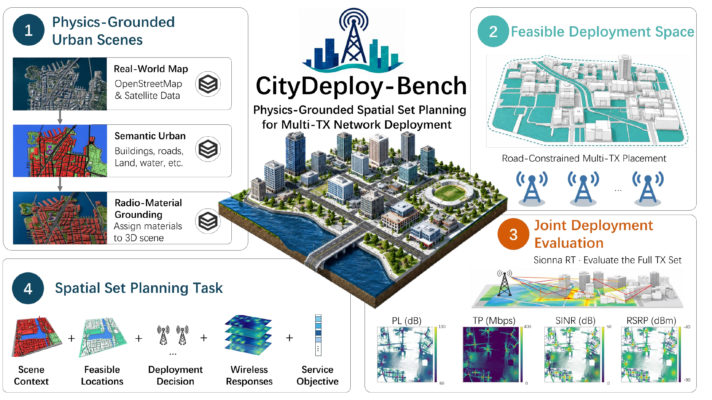
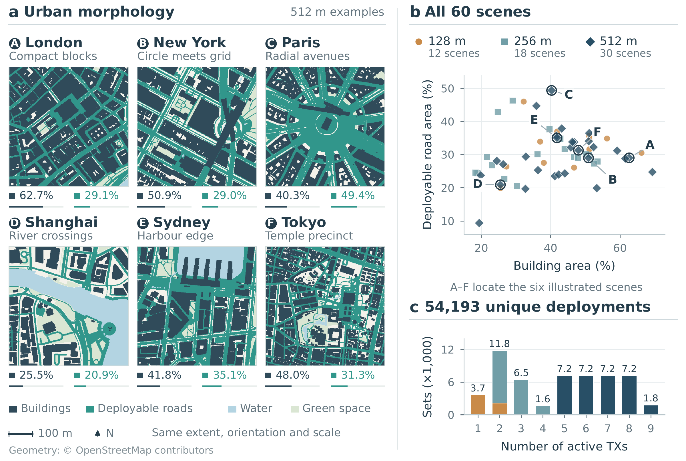

<h1 align="center">CityDeploy-Bench</h1>

<p align="center">
  <b>Benchmarking Physics-Grounded Spatial Set Planning<br>
  for Multi-Transmitter Network Deployment</b>
</p>

<p align="center">
  Chenyang Yuan &nbsp;·&nbsp; Xiaoyuan Cheng<br>
  <a href="https://arxiv.org/abs/2610.11065">Paper · arXiv:2610.11065</a> &nbsp;·&nbsp;
  <a href="https://arxiv.org/pdf/2610.11065">PDF</a>
</p>

<p align="center">
  <a href="#quickstart">Quickstart</a> &nbsp;·&nbsp;
  <a href="#benchmark">Benchmark</a> &nbsp;·&nbsp;
  <a href="https://huggingface.co/datasets/Chenyang-Yuan/CityDeploy-Data">Dataset</a> &nbsp;·&nbsp;
  <a href="#models-and-planners">Methods</a> &nbsp;·&nbsp;
  <a href="#train-and-evaluate">Train &amp; evaluate</a> &nbsp;·&nbsp;
  <a href="#documentation">Documentation</a>
</p>

<p align="center">
  <a href="docs/assets/benchmark_overview.png"></a>
</p>

**Where should a coordinated set of transmitters be placed in a city?** CityDeploy-Bench studies this question under road constraints, urban obstruction, and inter-transmitter interference. A learned utility guides deployment search; **Sionna RT verifies the selected, feasible TX set**.

- **Learn** scene-conditioned utility with four interchangeable model architectures.
- **Plan** unordered transmitter sets with nine sampling and optimization methods.
- **Verify** spatial radio maps and joint coverage, with search budgets and repeated-seed results recorded separately.

> **Release status.** This repository contains source code, configurations, tests, and a self-contained synthetic tutorial. The companion [CityDeploy-Data repository on Hugging Face](https://huggingface.co/datasets/Chenyang-Yuan/CityDeploy-Data) is fully uploaded and verified, with separate download layers for deployment labels and cached scene tensors, 67 portable scene packages, and 36,599 archived Radio Maps. See the [release verification](https://huggingface.co/datasets/Chenyang-Yuan/CityDeploy-Data/blob/main/metadata/release_status.json). No datasets or pretrained weights are bundled in this code repository. Original simulation outputs are for noncommercial research; geographic layers retain their upstream terms.

**Platform validation:** Linux automated tests, the synthetic smoke test and package build passed for the initial source release. Windows has one known path-alias comparison failure in its test suite; it is not advertised as fully CI-validated. See [platform notes](docs/troubleshooting.md#platform-validation).

## Quickstart

From the repository directory, run the following to try all four models and all nine planners **without urban data or a GPU**:

```console
conda env create -f environment.yml
conda activate citydeploy
python -m pip install torch==2.5.1 --index-url https://download.pytorch.org/whl/cpu
python -m pip install -e .
citydeploy doctor
citydeploy demo --all-samplers
```

Open `outputs/demo/preview.png` to inspect example deployments and `outputs/demo/summary.json` for all 36 model–planner combinations. The tutorial uses analytic synthetic labels and one-epoch training: it checks the complete learning/search workflow, not physical radio performance. Choose a new `--output` directory to repeat it.

**Next:** [GPU and radio installation](docs/installation.md) · [Tutorial walkthrough](docs/quickstart.md) · [Troubleshooting](docs/troubleshooting.md)

Python 3.10 is the tested baseline. Select the PyTorch CPU or CUDA build before installing the project. The environment name `citydeploy` is a convention, not a requirement.

## Benchmark

The reference **CityDeploy-Data** corpus spans London, New York, Paris, Shanghai, Sydney, and Tokyo.

| Urban scenes | Spatial scales | Unique deployments | Utility models | Planners |
| :---: | :---: | :---: | :---: | :---: |
| **60** across **6 cities** | **128 / 256 / 512 m** | **54,193** | **4** | **9** |

<p align="center">
  <a href="docs/assets/scene_morphology.png"></a>
</p>

*From the manuscript: representative urban layouts, scene composition, and deployment cardinalities. Geometry: © OpenStreetMap contributors.*

Each deployment contains metric and normalized TX coordinates, scene context, marginal coverage, and joint coverage. **Joint coverage** is the fraction of road evaluation cells satisfying all four configured criteria simultaneously: Path Loss, SS-RSRP, SINR, and Effective Throughput. The entire active TX set is simulated, including its interference.

Scene-level splits support unseen-geography evaluation. Deployment-family identities support within-family comparisons during training. See the [data contract](docs/data.md) for schemas, normalization, and split rules, and the [RF specification](docs/methods.md#physical-evaluation) for thresholds and physical assumptions.

## Models and planners

Utility learning and deployment search use separate interfaces. **Any of the four models can guide any of the nine planners.** Changing the model does not require rewriting the planner.

| Utility model | Representation | Training option |
| --- | --- | --- |
| **HPEM** | Scene-conditioned hypergraph potentials, orders 1–4 and a global term | `--model hpem` |
| **Regressor** | Permutation-invariant pooled TX embeddings | `--model regressor` |
| **IN** | Pairwise interaction network | `--model in` |
| **NRI** | Learned categorical pairwise relations | `--model nri` |

| Planner family | Methods | `--sampler` values |
| --- | --- | --- |
| Diffusion-guided search | Diffusion | `diffusion` |
| Sequential Monte Carlo | WS-G, WS-L | `ws-g`, `ws-l` |
| Monte Carlo sampling | NUTS, BR-SNIS | `nuts`, `br-snis` |
| Heuristic optimization | Greedy, PSO, GA | `greedy`, `pso`, `ga` |
| Bayesian optimization | TuRBO | `turbo` |

These are task-adapted implementations; [method specifications](docs/methods.md) document their objectives, transitions, and scope. Particle count alone is not a matched computational budget: compare recorded reward-query counts and runtime as well as coverage.

## Train and evaluate

### 1. Prepare data

Supply compatible scene packages and a deployment dataset, or construct your own with the [scene and data guide](docs/scenes.md).

**Dataset entry:** [CityDeploy-Data on Hugging Face](https://huggingface.co/datasets/Chenyang-Yuan/CityDeploy-Data). Download the lightweight core for model training; add scene geometry for ray tracing and archived Radio Maps only when needed. See [data availability and loading](docs/data.md#dataset-availability). The synthetic quickstart above works without downloading the dataset.

The default workspace layout is:

```text
datasets/
  scenes/                       Scene packages and semantic inputs
  raytracing/urban_multicity/    Deployment rows, contracts, and splits
models/                         Trained utility models
outputs/                        Training and evaluation artifacts
```

```console
citydeploy init
citydeploy inspect-data datasets/raytracing/urban_multicity
citydeploy validate-data datasets/raytracing/urban_multicity
```

### 2. Train a utility model

```console
citydeploy train --model hpem --device cuda
```

Choose `hpem`, `regressor`, `in`, or `nri`. Editable presets live in `configs/models/`; the best model is exported to `models/<model>/checkpoint_best.pt`. Existing weights are protected against overwrite. [Training guide →](docs/training.md)

### 3. Search and verify a deployment

First install the [radio extra](docs/installation.md#physical-evaluation). With scene `london_01` and trained HPEM weights available, this minimal example searches for five TX locations and performs physical verification:

```console
citydeploy evaluate --checkpoint models/hpem/checkpoint_best.pt --scene london_01 --num-tx 5 --sampler diffusion --device cuda --ray-device gpu
```

Change `--checkpoint` to select a utility model, or `--sampler` to select a planner. Use `--checkpoints` for an ordered model sweep; add `--seed 42 --num-seeds 5 --seed-step 10` for five repeated runs. Set particle, step, and method-specific budgets explicitly for comparisons. The [evaluation guide](docs/planning.md) provides complete commands, budget controls, and a manuscript example of the saved maps.

Each successful seed saves **TX coordinates, predictions, physically verified coverage, timing, search diagnostics, raw radio-map arrays, and five metric maps**. `citydeploy plan` performs learned search only; `citydeploy evaluate` adds feasibility repair and ray tracing.

### 4. Compare experiments

| Research question | Entry point | Guide |
| --- | --- | --- |
| Which planner works best at a fixed TX count? | `citydeploy benchmark` | [Fixed-cardinality experiments](docs/reproduction.md) |
| How many TXs reach a coverage target? | `citydeploy target` | [Target-coverage evaluation](docs/planning.md#target-coverage) |
| How does target-scene adaptation change performance? | `citydeploy adapt` | [Adaptation protocol](docs/reproduction.md) |
| What are the mean and standard deviation over seeds? | `citydeploy summarize` | [Files and aggregation](docs/planning.md#files-and-aggregation) |

Reference configurations are starting points, not a claim of complete paper reproduction. Exact reproduction also needs matching data snapshots, model weights or training settings, and per-experiment budgets. See [reproduction requirements](docs/reproduction.md).

## Documentation

| Get started | Run research | Understand and extend |
| --- | --- | --- |
| [Installation](docs/installation.md) | [Training](docs/training.md) | [Method specifications](docs/methods.md) |
| [Synthetic quickstart](docs/quickstart.md) | [Planning and evaluation](docs/planning.md) | [Data contract](docs/data.md) |
| [Troubleshooting](docs/troubleshooting.md) | [Reproduction and adaptation](docs/reproduction.md) | [Custom scenes](docs/scenes.md) |
| [Environment snapshot](constraints-tested.txt) | [Configuration presets](citydeploy/configs) | [Development and tests](docs/development.md) |

For code navigation: [`energy_model/`](energy_model) implements utility learning; [`samplers/`](samplers) implements deployment search; [`dataset_builder/`](dataset_builder), [`scene_builder/`](scene_builder), and [`radio_backend/`](radio_backend) provide data and physical evaluation; [`citydeploy/`](citydeploy) exposes the unified interface. Map plotting lives in [`visualization/`](visualization).

Paths resolve relative to the current working directory. Use `citydeploy --workspace <directory> ...` to choose another existing workspace. No developer-specific directory structure is required.

## Citation and license

If you use CityDeploy-Bench or CityDeploy-Data in your research, please cite our [paper](https://arxiv.org/abs/2610.11065):

```bibtex
@misc{yuan2026citydeploybench,
  title         = {CityDeploy-Bench: Benchmarking Physics-Grounded Spatial Set Planning for Multi-Transmitter Network Deployment},
  author        = {Chenyang Yuan and Xiaoyuan Cheng},
  year          = {2026},
  eprint        = {2610.11065},
  archivePrefix = {arXiv},
  primaryClass  = {cs.LG},
  url           = {https://arxiv.org/abs/2610.11065}
}
```

Machine-readable citation metadata, including the preferred paper citation, are available in [CITATION.cff](CITATION.cff).

| Component | Terms |
| --- | --- |
| First-party code | [MIT](LICENSE) |
| Geo2SigMap-derived components | [CC BY-NC 4.0; file-level scope](THIRD_PARTY_NOTICES.md) |
| Manuscript figures and geographic imagery | [Separate visual-asset attribution and terms](docs/assets/README.md) |
| External datasets, weights, and software | Their respective release terms |

The complete distribution is **not uniformly MIT**. See [third-party notices](THIRD_PARTY_NOTICES.md) before redistribution or commercial use.
