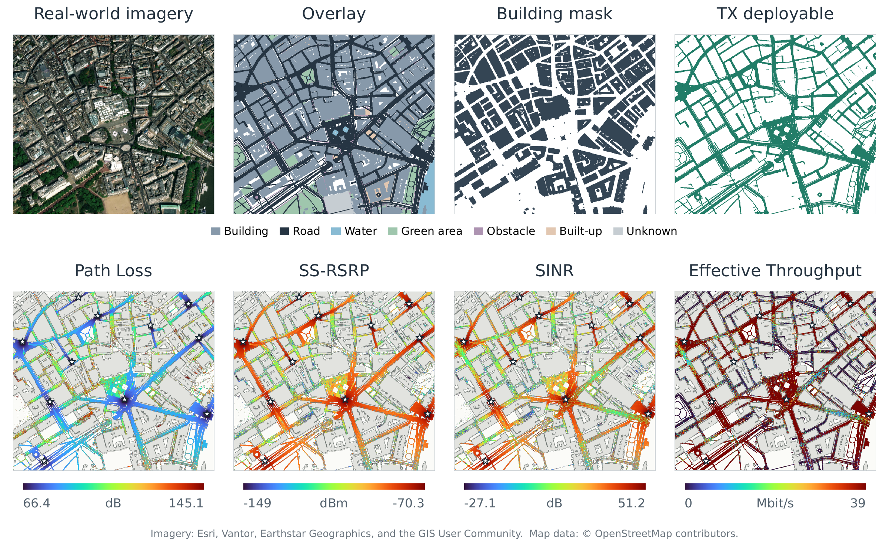

# Planning and evaluation

## Search is not physical coverage

`citydeploy plan` saves continuous candidates scored by a learned model. It does not certify road feasibility or simulate service. `citydeploy evaluate` searches with feasibility penalties, visits candidates in predicted-score order until it can repair one to feasible road locations, then scores and physically evaluates that repaired set. It does not rerank every repaired candidate with ray tracing. Inspect both prediction and simulation fields.

```console
citydeploy evaluate --checkpoint models/hpem/checkpoint_best.pt --scene london_01 --num-tx 5 --sampler ws-g --num-particles 50 --steps 100 --ess-threshold 0.5 --proposal-scale-start 0.45 --proposal-scale-end 0.08 --mutation-steps 1 --rf-profile configs/rf/urban_3p65ghz.json --seed 42 --num-seeds 5 --seed-step 10 --device cuda --ray-device gpu --output-root outputs/ws_g
```

For an ordered four-model sweep:

```console
citydeploy evaluate --checkpoints models/hpem/checkpoint_best.pt models/regressor/checkpoint_best.pt models/in/checkpoint_best.pt models/nri/checkpoint_best.pt --scene london_01 --num-tx 5 --sampler diffusion --num-particles 100 --steps 100 --mc-samples 10 --sigma-max 0.35 --sigma-min 0.005 --boundary reflect --rf-profile configs/rf/urban_3p65ghz.json --seed 42 --num-seeds 5 --seed-step 10 --device cuda --ray-device gpu --output-root outputs/model_sweep
```

All examples are single lines usable in PowerShell or a POSIX shell. Use `citydeploy evaluate --help` for every parameter. Do not pass several paths to the singular `--checkpoint` flag.

## Important budget controls

| Public name | Internal identifier | Main budget controls |
| --- | --- | --- |
| Diffusion | `diffusion` | particles, steps, MC samples per particle |
| WS-G | `smc_gaussian` | particles, tempering steps, mutation steps |
| WS-L | `smc_langevin` | particles, tempering steps, gradient-based mutation steps |
| NUTS | `nuts` | chains (`num-particles`), warmup, retained samples, maximum tree depth |
| BR-SNIS | `br_snis` | chains, rounds, proposal particles |
| Greedy | `greedy` | returned solutions, candidate pool, refinement rounds |
| PSO | `pso` | swarm particles and iterations |
| GA | `ga` | population and generations (`--steps`) |
| TuRBO | `turbo` | explicit evaluation budget, initial points, batch size, GP steps |

One particle is a complete TX configuration except Greedy's intermediate partial sets. Equal population and iteration counts do **not** imply equal computation. Gradient calls and GP fitting also have different costs. Compare `num_reward_evaluations`, inference time and physical verification time alongside coverage. The reference plans retain method-specific budgets; they are not equal-budget comparisons.

## Files and aggregation



*Manuscript example: scene inputs and Path Loss, SS-RSRP, SINR, and Effective Throughput for a manually specified 11-TX deployment near Trafalgar Square. This illustrates the spatial outputs, not an optimized baseline or a performance comparison. [Figure attribution](assets/README.md).*

Each successful seed records:

- `result.json`: coordinates, normalized coordinates, configuration, model identity, prediction, physical marginal/joint coverage, time and model-evaluation counts.
- `candidates.npz` and `trace.json`: search outputs and diagnostics.
- `radio_maps.npz`: raw metric fields, serving association, coverage masks and road denominator.
- Five PNG maps: Path Loss, SS-RSRP, SINR, Effective Throughput and Joint Coverage.

```console
citydeploy summarize outputs/model_sweep --output outputs/model_sweep_summary.csv
```

This summary keeps scene, TX count, method, model and protocol separate. It does not average the four models together. Coverage is a fraction in `[0,1]`; multiply means and standard deviations by 100 for percentages. Standard deviation uses `ddof=1` and is undefined for one seed. Duplicate condition/seed records are rejected. Missing experiments remain missing, not zero-valued failures. The command only reads complete fixed-TX `result.json` records; benchmark/adaptation runners also maintain their own native summaries.

Runtime records can contain the executing researcher's paths and timing for provenance. They are not part of the source distribution and should be reviewed before sharing results.

## Target coverage

```console
citydeploy target --plan configs/experiments/paris_07_hpem_target70.json --dry-run
citydeploy target --plan configs/experiments/paris_07_hpem_target70.json --max-trials 1
```

Edit the plan for scene, target fraction, checkpoint, seeds and TX range. Use the runner's `--resume` option with the exact experiment directory to continue. A reported first successful TX count is conditional on the finite tested counts, seeds and search budgets, not a global minimum-TX certificate. Simulation errors do not count as failed coverage. Interference can make coverage non-monotonic with TX count.

For manual placement use `citydeploy manual --scene london_01 --device gpu` with packaged scenes and the radio extra. Outputs remain in the workspace, separate from the dataset.
